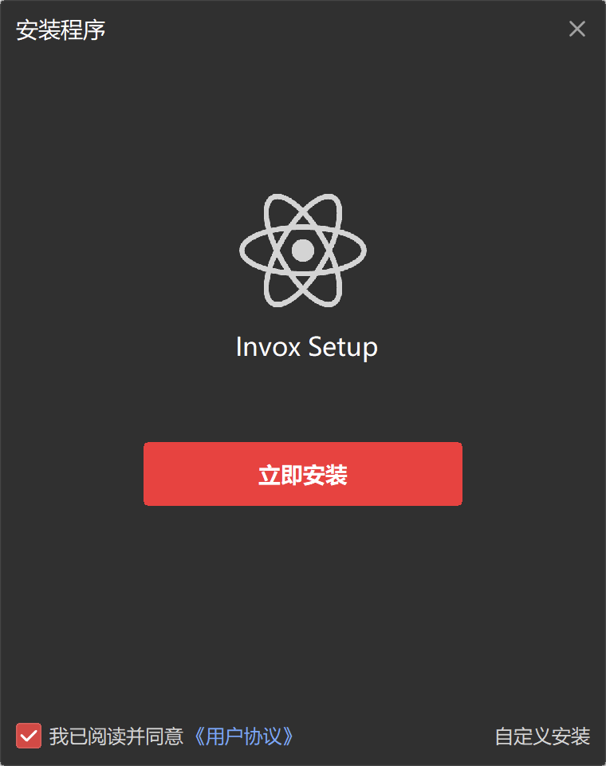
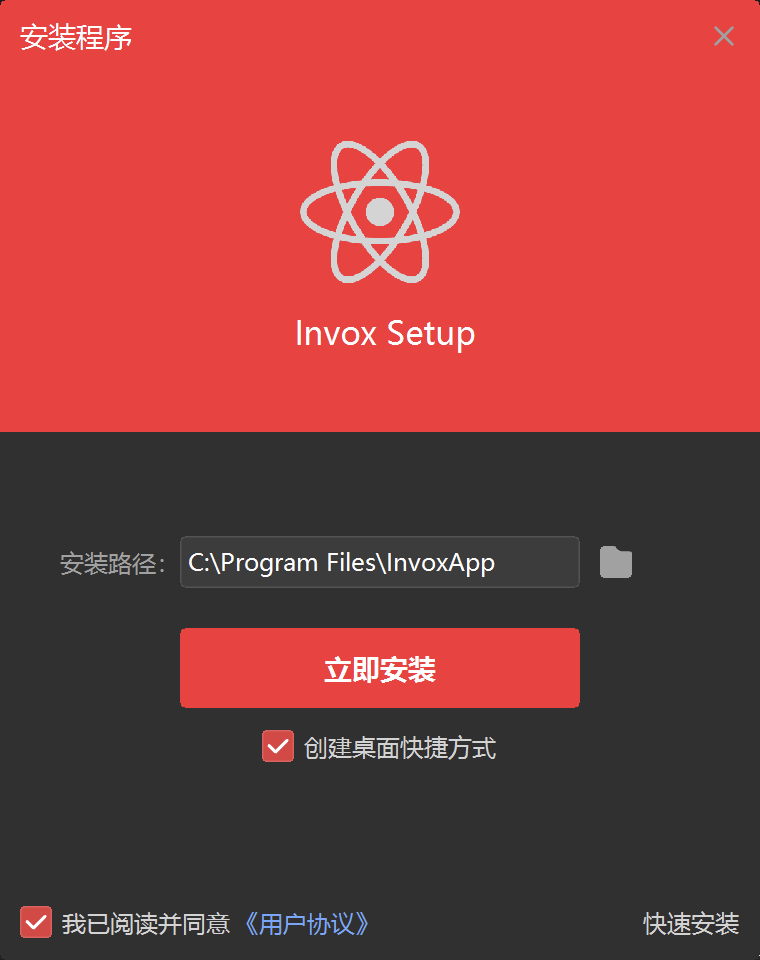
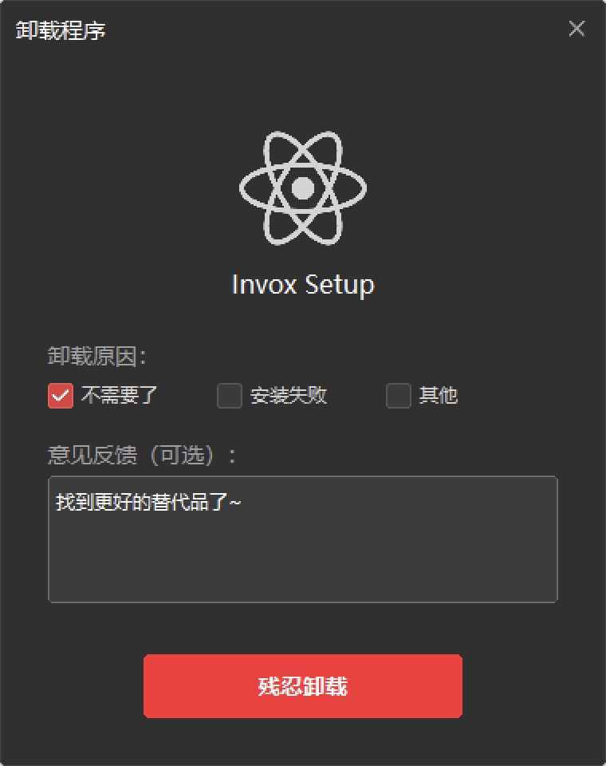

# Invox Setup（安装/卸载器）

本项目基于 DuiLib 框架开发，提供了功能完整的 Windows 应用安装/卸载解决方案。具有以下特点：

- **轻量级**：整体体积仅 2MB+，无需额外依赖
- **数据上报**：内置 Analytics 支持，可追踪安装/卸载行为
- **界面灵活**：采用类 HTML 的 XML 布局方式，易于定制
- **国际化**：支持中英文等多语言切换
- **用户友好**：提供进度显示、协议确认、路径选择等完整安装体验

## 界面预览

| 快速安装 | 自定义安装 | 卸载界面 |
|:---:|:---:|:---:|
|  |  |  |

## 配置说明

### 修改应用配置 (Config.h)

```cpp
#define APP_NAME           L"InvvoxApplication"     // 应用名称
#define APP_VERSION        L"1.0.0"                 // 应用版本
#define APP_PUBLISHER      L"YourCompany"           // 发布者
#define APP_EXE_NAME       L"InvvoxApplication.exe" // 主程序名
#define APP_UNINSTALL_NAME L"Uninstaller.exe"       // 卸载程序名
#define APP_ARCHIVE        L"app.7z"                // 安装包文件名
#define PRIVACY_URL        L"https://..."           // 协议地址
#define ANALYTICS_ENDPOINT L"https://..."           // 分析 API 端点
```

### 准备安装包

1. 将需要安装的文件压缩为 `app.7z`，放在：`bin/app.7z`
2. 确保卸载程序 `Uninstall.exe` 包含在 `app.7z` 压缩包根目录中
3. 把 `Installer/Res/*` 中资源压缩为 `Installer/Res/resources.zip`
4. 把 `Uninstaller/Res/*` 中资源压缩为 `Uninstaller/Res/resources.zip`

#### 压缩如下资源 (resources.zip)

 - `Res/images/*`
 - `Res/resources/*`
 - `Res/installer.xml` / `Res/uninstaller.xml`

### 国际化配置

语言文件位于 `Res/resources/` 目录：
- `lan_cn.xml` - 中文语言包
- `lan_en.xml` - 英文语言包

程序会根据系统语言自动选择对应的语言包。

## 编译说明

### 前置要求

1. Visual Studio 2010 或更高版本
2. DuiLib 库已正确配置
3. Windows SDK

### 编译步骤

1. 打开 Visual Studio
2. 分别编译 Installer 和 Uninstaller 项目
3. 编译后的 Debug 程序需要如下资源配合使用：
   - Installer.exe
   - Uninstaller.exe
   - Res 文件夹
   - 7zxa.dll
   - app.7z（压缩的应用文件）
4. 编译后的 Release 为独立可运行的程序
   - Installer.exe
   - Uninstaller.exe

## 注册表结构

安装程序会在以下位置写入注册表：

```
HKEY_LOCAL_MACHINE\Software\Microsoft\Windows\CurrentVersion\Uninstall\<AppName>
```

或

```
HKEY_CURRENT_USER\Software\Microsoft\Windows\CurrentVersion\Uninstall\<AppName>
```

包含以下键值：
- DisplayName - 显示名称
- DisplayVersion - 版本号
- Publisher - 发布者
- InstallLocation - 安装路径
- UninstallString - 卸载命令
- EstimatedSize - 估计大小（KB）
- NoModify - 禁用修改
- NoRepair - 禁用修复

## 数据分析

### Analytics 类

提供了 HTTP POST 方式上报数据到服务器的功能。

#### 安装事件上报

```cpp
CAnalytics::GetInstance()->ReportInstall(
    APP_NAME,           // 应用名称
    APP_VERSION,        // 版本号
    m_strInstallPath    // 安装路径
);
```

上报数据格式（JSON）：
```json
{
  "event_type": "install",
  "app_name": "InvvoxApplication",
  "version": "1.0.0",
  "install_path": "C:\\Program Files\\InvvoxApplication",
  "os_version": "Windows 10.0",
  "timestamp": "2025-10-11 12:30:45"
}
```

#### 卸载事件上报

```cpp
CAnalytics::GetInstance()->ReportUninstall(
    APP_NAME,       // 应用名称
    reason,         // 卸载原因
    feedback        // 用户反馈
);
```

上报数据格式（JSON）：
```json
{
  "event_type": "uninstall",
  "app_name": "InvvoxApplication",
  "reason": "不需要了",
  "feedback": "功能不符合需求",
  "timestamp": "2025-10-11 12:35:20"
}
```

## UI 界面定制

### 修改界面布局

编辑 `Res/installer.xml` 或 `Res/uninstaller.xml` 文件即可修改界面布局。

主要 DuiLib 控件：
- `Window` - 窗口
- `VerticalLayout` / `HorizontalLayout` - 布局容器
- `Label` - 文本标签
- `Button` - 按钮
- `CheckBox` - 复选框
- `Option` - 单选按钮
- `Edit` / `RichEdit` - 文本编辑框
- `Progress` - 进度条
- `Container` - 容器

### 修改颜色和样式

在 XML 中使用以下属性：
- `bkcolor` - 背景颜色（格式：#AARRGGBB）
- `forecolor` - 前景颜色
- `textcolor` - 文本颜色
- `bordercolor` - 边框颜色
- `font` - 字体 ID（在 XML 开头定义）
- `normalimage` / `hotimage` / `pushedimage` - 按钮图片

## 许可证

本项目基于 DuiLib 开发，请遵守 DuiLib 的许可协议。

## 作者

基于 DuiLib Ultimate 框架开发
